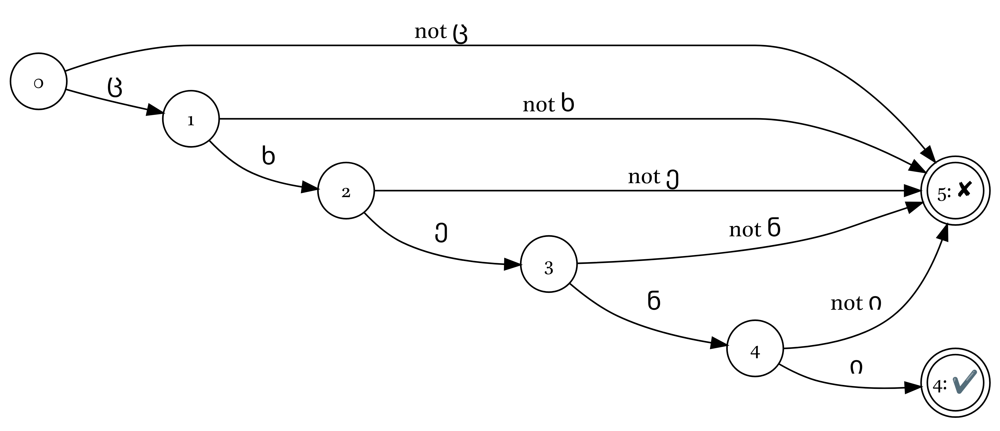
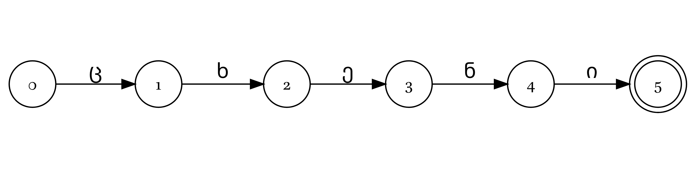
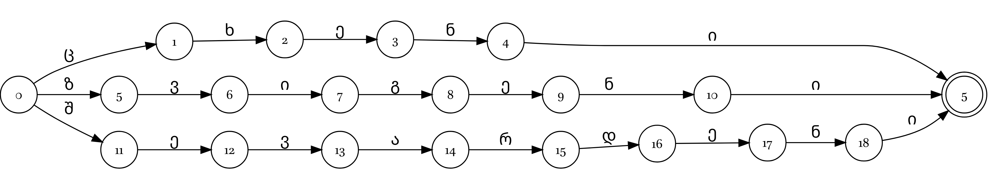
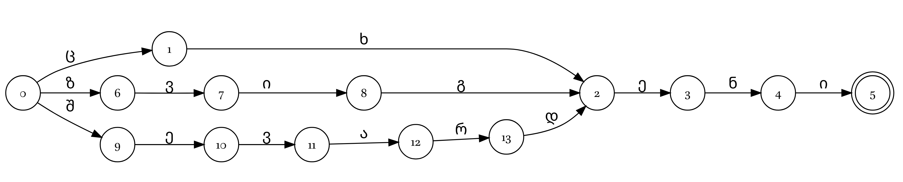

# What is FST?

Finite-state transducer can be used in order to create rule based morphological parsers.  A parser built with these tools can handle both analyzing and generating forms within the same set of rules. It's important to remember that there is no one single "correct" way to analyze morphology; it depends on what you need. Because of this, creating an FST analyzer is like create a digital representation of a grammatical description and a dictionary into a computer-readable format.

What are the alternatives:

- parser from SIL Fieldworks;
- non FST rule-based approach by T. Arkhangelskiy [@arkhangelskiy12];
- morphological parsers that are specific for some languages (e. g. `mystem` for Russian);
- Neural Networks, but adjusting those systems is much more complicated than tweaking rule-based models.

## What is morphological analysis?

Morphological analysis involves defining a word’s grammatical form, identifying its base root, and translating the stem meaning. For example, Georgian მინდვრის [mindvris] is linked to the [gen.sg]{.smallcaps} form of the stem მინდორი [mindori], which means 'meadow'. Depending on their goals, linguists emphasize different parts; theoretical researchers typically focus more on translatings stems and don't provide the stem itself.

## Finite-state machine

Finite-state machine (or automaton) is a mathematical model. FSM can be in exactly one of a finite number of states at any given time. The FSM can change from one state to another in response to some inputs; the change from one state to another is called a transition.

```{r}
#| eval: false

library(DiagrammeR)
grViz('
  digraph G { rankdir="LR"
  node [fontname="Brill",shape=circle,fontsize=14,fixedsize=true]
  edge [fontname="Brill",fontsize=18]
  0 [label="0"];
  1 [label="1"];
  0 -> 1 [label="up"];
  0 -> 0 [label="down"];
  1 -> 1 [label="up"];
  1 -> 0 [label="down"];
}')

grViz('
  digraph G { rankdir="LR"
  node [fontname="Brill",shape=circle,fontsize=14,fixedsize=true]
  edge [fontname="Brill",fontsize=16]
  0 [label="closed"];
  1 [label="open"];
  0 -> 1 [label="show pass"];
  0 -> 0 [label="push"];
  1 -> 1 [label="show pass"];
  1 -> 0 [label="push"];
}') 
```

```{r}
#| layout: "[[1,2],[1,2]]"

knitr::include_graphics("images/01_01_light_switch.jpg")
knitr::include_graphics("images/01_02_light_switch_automaton.png")
knitr::include_graphics("images/01_03_turnstile.jpg")
knitr::include_graphics("images/01_04_turnstile_automaton.png")
```

The most important that FSM consists of:

- alphabet that can trigger some transition;
- finite number of states;
- transitions between states;
- one initial state (often denoted as `0`);
- set of the final states (often denoted with the double circle).

```{r}
#| eval: false

grViz('
  digraph G { rankdir="LR"
  node [fontname="Brill",shape=circle,fontsize=14,fixedsize=true]
  edge [fontname="Brill",fontsize=16]
  5 [label="4: ✔️",shape=doublecircle];
  6 [label="5: ✘",shape=doublecircle];
  0 -> 1 [label="ც"];
  0 -> 6 [label="not ც"];
  1 -> 2 [label="ხ"];
  1 -> 6 [label="not ხ"];
  2 -> 3 [label="ე"];
  2 -> 6 [label="not ე"];
  3 -> 4 [label="ნ"];
  3 -> 6 [label="not ნ"];
  4 -> 5 [label="ი"];
  4 -> 6 [label="not ი"];
}') 
```

```{r}
#| out-width: 100%
#| fig-cap: FSM for Georgian ცხენი [tskheni] 'horse'


```

If the program handled the full path to the final state (double circle), then we have success, otherwise it failed. Usually failure path are not displayed.

```{r}
#| eval: false

grViz('
  digraph G { rankdir="LR"
  node [fontname="Brill",shape=circle,fontsize=14,fixedsize=true]
  edge [fontname="Brill",fontsize=16]
  5 [label="5",shape=doublecircle];
  0 -> 1 [label="ც"];
  1 -> 2 [label="ხ"];
  2 -> 3 [label="ე"];
  3 -> 4 [label="ნ"];
  4 -> 5 [label="ი"];
}') 
```

```{r}
#| out-width: 100%
#| fig-cap: FSM for Georgian ცხენი [tskheni] 'horse'


```

It is possible to store multiple words:

```{r}
#| eval: false

grViz('
  digraph G { rankdir="LR"
  node [fontname="Brill",shape=circle,fontsize=14,fixedsize=true]
  edge [fontname="Brill",fontsize=16]
  100 [label="5",shape=doublecircle];
  0 -> 1 [label="ც"];
  1 -> 2 [label="ხ"];
  2 -> 3 [label="ე"];
  3 -> 4 [label="ნ"];
  4 -> 100 [label="ი"];
  0 -> 5 [label="ზ"];
  5 -> 6 [label="ვ"];
  6 -> 7 [label="ი"];
  7 -> 8 [label="გ"];
  8 -> 9 [label="ე"];
  9 -> 10 [label="ნ"];
  10 -> 100 [label="ი"];
  0 -> 11 [label="შ"];
  11 -> 12 [label="ე"];
  12 -> 13 [label="ვ"];
  13 -> 14 [label="ა"];
  14 -> 15 [label="რ"];
  15 -> 16 [label="დ"];
  16 -> 17 [label="ე"];
  17 -> 18 [label="ნ"];
  18 -> 100 [label="ი"];
}') 
```

```{r}
#| out-width: 100%
#| fig-cap: FSM for Georgian ცხენი [tskheni] 'horse', ზვიგენი [zvigeni] 'shark', შევარდენი [shevardeni] 'falcon'


```

As you can see there is a room for the optimisation:

```{r}
#| eval: false

grViz('
  digraph G { rankdir="LR"
  node [fontname="Brill",shape=circle,fontsize=14,fixedsize=true]
  edge [fontname="Brill",fontsize=16]
  5 [label="5",shape=doublecircle];
  0 -> 1 [label="ც"];
  1 -> 2 [label="ხ"];
  2 -> 3 [label="ე"];
  3 -> 4 [label="ნ"];
  4 -> 5 [label="ი"];
  0 -> 6 [label="ზ"];
  6 -> 7 [label="ვ"];
  7 -> 8 [label="ი"];
  8 -> 2 [label="გ"];
  0 -> 9 [label="შ"];
  9 -> 10 [label="ე"];
  10 -> 11 [label="ვ"];
  11 -> 12 [label="ა"];
  12 -> 13 [label="რ"];
  13 -> 2 [label="დ"];
}') 
```

```{r}
#| out-width: 100%
#| fig-cap: FSM for Georgian ცხენი [tskheni] 'horse', ზვიგენი [zvigeni] 'shark', შევარდენი [shevardeni] 'falcon'


```

It is useful to mention, that there is another way of representing the FSM. This called ATT format:

| initial state | final state | input |
|---------------|-------------|-------|
| 0             | 1           | ც     |
| 1             | 2           | ხ     |
| 2             | 3           | ე     |
| 3             | 4           | ნ     |
| 4             | 5           | ი     |
| 0             | 6           | ზ     |
| 6             | 7           | ვ     |
| 7             | 8           | ი     |
| 8             | 2           | გ     |
| 0             | 9           | შ     |
| 9             | 10          | ე     |
| 10            | 11          | ვ     |
| 11            | 12          | ა     |
| 12            | 13          | რ     |
| 13            | 2           | დ     |

### Finite-state transducers {#sec-transducers}


