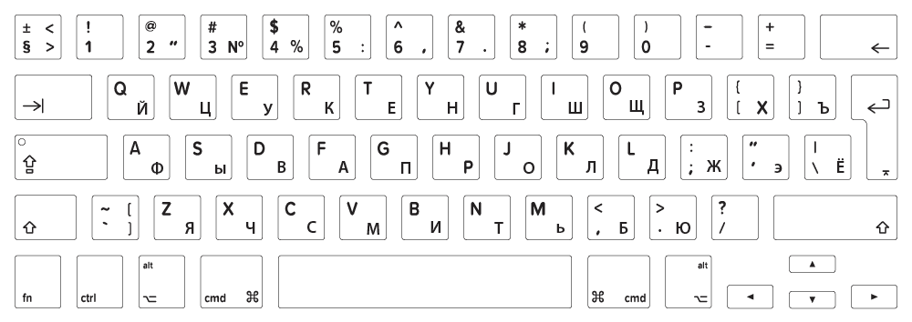

# Transliteration

It is hard to work since we have multiple orthographies to work with: Georgian, Latin, IPA, Cyrillic.

## Layouts

### Georgian layout

I find it useful to install Georgian layout on your PC.

```{r}
#| fig-cap: "Georgian layout (Mac version)"
#| echo: false

knitr::include_graphics("images/georgian-qwerty-layout.png")
```

Unlike Russian layout Georgian to Latin correspondences are mostly straitforward except several pecularities:

- ejective letters are mostly default, but
    - /pʰ/ ფ (letter pani) is `f` 
    - /tʰ/ თ (letter tani) is `Shift + t`
    - /kʰ/ ქ (letter kani) is `q`
    - /t͡sʰ/ ც (letter tsani) is `c`
    - /t͡ʃʰ/ ჩ (letter chini) is `Shift + c`
    - with exceptions of
      - /t͡s'/ ც (letter ts'ani) is `w`
      - /t͡ʃ'/ ჭ (letter ch'ari) is `Shift + w`
- /dz/ ძ (letter dzili) is `Shift + z`
- /ʒ/ ჟ (letter zhani) is `Shift + j`
- /ʃ/ შ (letter shini) is `Shift + s`
- /ɣ ~ ʁ/ ღ (letter ghani) is `Shift + r`
- /x ~ χ/ ხ (letter khani) is `Shift + x`
- /q'/ ყ (letter q'ari) is `y`

### Russian layout

In case you will need to cite something from [@desheriev53].

```{r}
#| fig-cap: "Russian layout (Mac version)"
#| echo: false


```

## Transliteration

I decided to use transliteration system from [@wichersschreur2025]:

| la | mkh |
|----|-----|
| a  | ა   |
| b  | ბ   |
| c  | ც   |
| c' | წ   |
| č  | ჩ   |
| č' | ჭ   |
| d  | დ   |
| e  | ე   |
| ĕ  | ე̆   |
| g  | გ   |
| ğ  | ღ   |
| h  | ჰ   |
| ħ  | ჰ'  |
| i  | ი   |
| ĭ  | ი̆   |
| j  | ჲ   |
| k  | ქ   |
| k' | კ   |
| l  | ლ   |
| ɬ  | ლ'  |
| m  | მ   |
| n  | ნ   |
| o  | ო   |
| ŏ  | ო̆   |
| p  | ფ   |
| p' | პ   |
| q  | ჴ   |
| qq | ჴჴ  |
| q' | ყ   |
| r  | რ   |
| s  | ს   |
| š  | შ   |
| t  | თ   |
| t' | ტ   |
| t’ | ტ   |
| u  | უ   |
| ŭ  | უ̆   |
| v  | ვ   |
| w  | ჳ   |
| x  | ხ   |
| z  | ზ   |
| ž  | ჟ   |
| ʒ  | ძ   |
| ǯ  | ჯ   |
| ʕ  | ჵ   |
| Ɂ  | ჸ   |
| ⁿ  | ჼ   |
