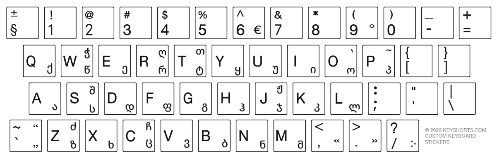

# Transliteration

It is hard to work since we have multiple orthographies to work with: Georgian, Latin, IPA, Cyrillic.

## Georgian layout

I find it useful to install Georgian layout on your PC.

```{r}
#| fig-cap: "Georgian layout"
#| echo: false


```

Unlike Russian layout Georgian to Latin correspondences are mostly straitforward except several pecularities:

- ejective letters are mostly default, so
    - /pʰ/ ფ (letter pani) is `f` 
    - /tʰ/ თ (letter tani) is `Shift + t`
    - /kʰ/ ქ (letter kani) is `q`
    - /t͡sʰ/ ც (letter tsani) is `c`
    - /t͡ʃʰ/ ჩ (letter chini) is `Shift + c`
    - but
      - /t͡s'/ ც (letter ts'ani) is `w`
      - /t͡ʃ'/ ჭ (letter ch'ari) is `Shift + w`
- /dz/ ძ (letter dzili) is `Shift + z`
- /ʒ/ ჟ (letter zhani) is `Shift + j`
- /ʃ/ შ (letter shini) is `Shift + s`
- /ɣ ~ ʁ/ ღ (letter ghani) is `Shift + r`
- /x ~ χ/ ხ (letter khani) is `Shift + x`
- /q'/ ყ (letter q'ari) is `y`